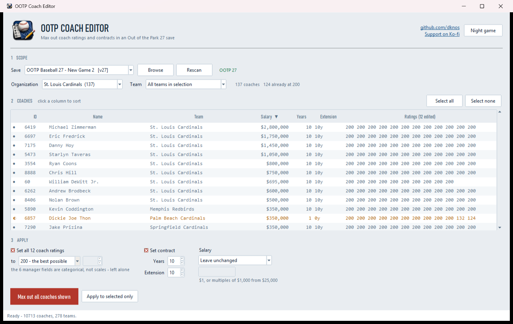
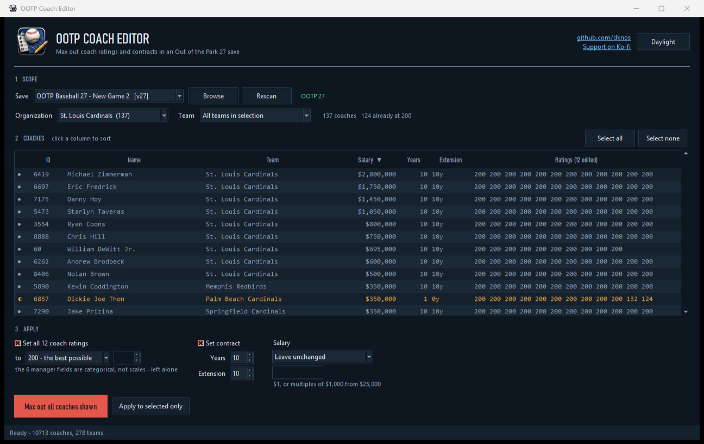

<p align="center">
  
</p>

<h1 align="center">OOTP Coach Editor</h1>

<p align="center">
  Max out coach ratings and contracts in an <b>Out of the Park Baseball 27</b> save.<br>
  One file, no install, no Python needed.
</p>

<p align="center">
  <a href="https://github.com/dknos/ootp-coach-editor/raw/main/OOTPCoachEditor.exe"><b>Download OOTPCoachEditor.exe</b></a>
  &nbsp;&middot;&nbsp;
  <a href="https://github.com/dknos/ootp-coach-editor/releases/latest">All releases</a>
  &nbsp;&middot;&nbsp;
  <a href="https://ko-fi.com/dknos">Support on Ko-fi</a>
</p>

---



<p align="center"><i>Light and dark - the toggle is top right, and your choice is remembered.</i></p>



## What it does

Pick a save, pick an organization or a single team, then max every coach in it.

- **All 12 numeric coach ratings set to 200** - Handle Development, Influences
  Mechanics, Handle Aging, Teach Hitting, Teach Pitching, Teach C, Teach IF,
  Teach OF, Teach Running, In-game Running, Scout Majors, Scout Minors.
- **Contract length and extension length**, up to 15 years each.
- **Salary** - leave alone, `$1`, the game's minimum, league average, that
  organization's average, or a custom figure.

It writes a backup of `coaches.dat` before every write, and refuses to run
while OOTP is open.

## How to use

1. **Close OOTP completely.** The game keeps the save in memory and will
   overwrite your changes on its next save. The tool checks and refuses.
2. Run `OOTPCoachEditor.exe`.
3. Pick your save - it finds everything under
   `Documents\Out of the Park Developments\*\saved_games\*.lg` automatically.
4. Pick an Organization (includes every affiliate) and optionally one Team.
5. Click any **column heading to sort** - by salary to find your expensive
   staff, or by ratings to find the weakest. Click again to reverse.
   The dot on the left is a checklist: filled means every rating is already
   maxed, half means partly done, hollow means untouched. Sort by it to see
   what is left.
6. Choose what to apply, then **Apply to selected** or **MAX OUT ALL COACHES**.
7. Load the save in OOTP.

## Verifying the download

Windows will warn you about an unrecognised app - the exe is not code-signed.
You can at least confirm you got the real file. In PowerShell:

```powershell
Get-FileHash .\OOTPCoachEditor.exe -Algorithm SHA256
```

It should match:

```
a7d9b60a7cf480ec9fc1c274514b81fb1676d6fcbc7a372735e4b3d8f633ade7
```

The same hash is published on the
[release page](https://github.com/dknos/ootp-coach-editor/releases/latest).

All the source is here - `app.py` (the interface) and `ootplib.py` (all save
parsing and editing). You can read exactly what it writes, and rebuild the exe
yourself with `build.bat`.

## Known limits - please read

- **OOTP 27 only.** The version is detected and anything else is refused.
  OOTP 26 stores coaches differently (team and organization fields read as
  garbage there), so editing a 26 save would corrupt it.

- **The six manager fields are left alone** - Manager Personality,
  Positive/Negative Relation, Manager Style, Hitting/Pitching Coach Focus.
  They are categorical ("Normal", "Easygoing", "Smallball"), not 0-200 scales,
  so there is nothing to max. Eight further bytes in the ratings block are
  unidentified and are never written.

- **Organization grouping is a heuristic** and over-includes one org: the id
  `1` doubles as a flag inside the coach record, so coaches from other farm
  systems can be swept into "Arizona Diamondbacks". If a count looks far too
  large, use the **Team** dropdown instead - the team field is read directly
  and is reliable.

- **Coaches with no contract only get ratings.** Most minor-league staff have
  no contract on file. The game never creates a term with no salary, and
  writing one would also make that record unreadable on the next run.

- **A few coaches cannot be fully read** and are skipped rather than guessed
  at - around 0.1% of a mature save, up to ~3% of a brand-new one. Counts are
  reported after every run.

## If something looks wrong

Every write leaves `coaches.dat.bak` (then `.bak1`, `.bak2`, ...) beside the
save. Close OOTP, delete `coaches.dat`, rename the backup back.

## How it works

There is no documentation for the OOTP save format - all of this was reverse
engineered, and every field was confirmed by making a known edit in the game's
own Ratings Editor and diffing the bytes. `ootplib.py` documents each finding
where it is used, including the traps:

- Coach records are **variable length** and are rewritten on every save, so
  offsets are recomputed from scratch immediately before each write.
- Ratings live in an 18-byte block at a **variable offset**, located by
  validating the contract that precedes it.
- **Teach Running and In-game Running are not in that block** - they sit at
  fixed offsets from the *end* of the record.
- Salary doubles as a locator check, which is why `$1` needs a dedicated
  last-resort pass rather than simply being allowed.

## Build it yourself

```
pip install pyinstaller
build.bat
```

## Disclaimer

Unofficial fan tool. Not affiliated with or endorsed by Out of the Park
Developments. It ships no game assets and only edits save files already on
your computer. Use at your own risk, and keep the backups it makes.

## License

MIT - see [LICENSE](LICENSE).
